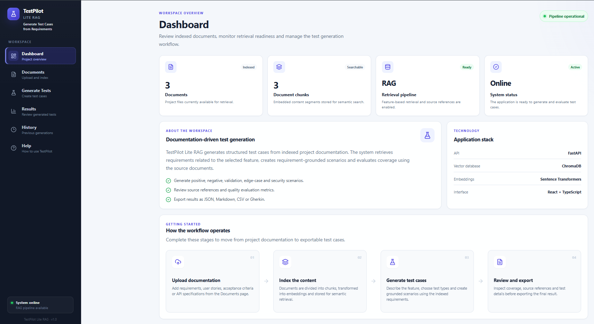
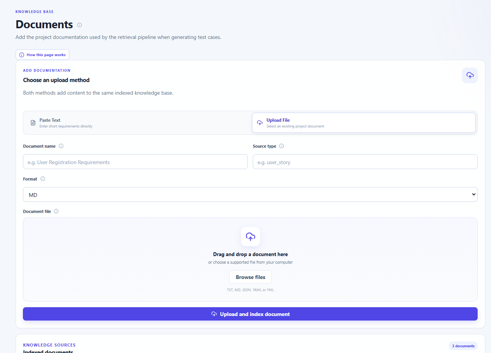
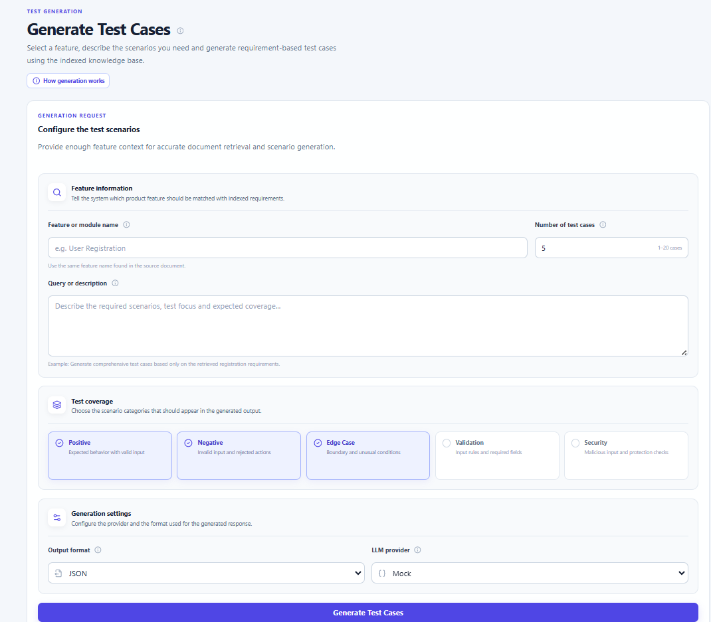
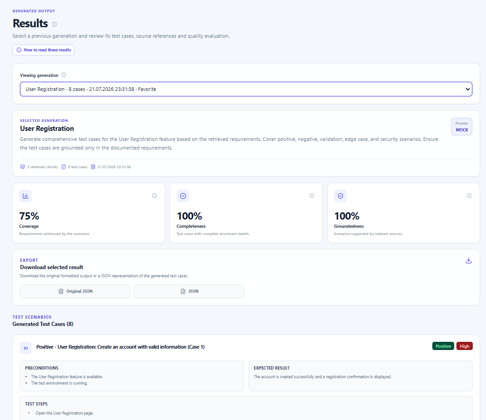
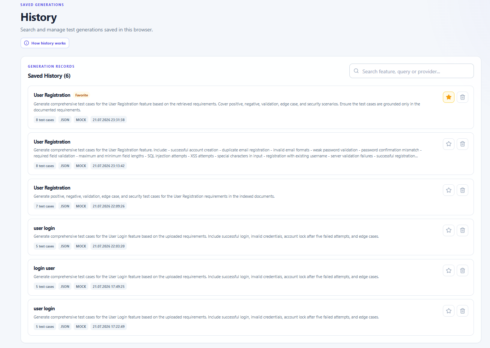
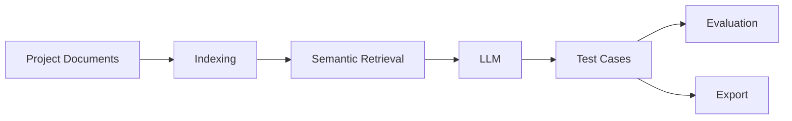

# TestPilot Lite RAG

Documentation-driven AI test case generation using **Retrieval-Augmented Generation (RAG)**.

TestPilot Lite RAG is a full-stack application that automatically generates structured software test cases from project documentation.

The system retrieves relevant requirements from an indexed knowledge base, generates grounded test scenarios using Large Language Models (LLMs), evaluates their quality and allows users to review, manage and export the generated results through a modern web interface.

---

## Highlights

- Upload software requirements and project documentation
- Semantic retrieval using ChromaDB and Sentence Transformers
- AI-powered software test generation
- Automatic quality evaluation
- Generation history with favorites
- Export generated test cases
- Modern React + TypeScript dashboard

---

## Dashboard

Monitor indexed documents, retrieval readiness and workspace status from a single dashboard.

<p align="center">
  
</p>

---

## Document Management

Upload project documentation using drag-and-drop or paste requirements directly into the knowledge base.

<p align="center">
  
</p>

## AI Test Generation

Generate structured software test cases by selecting a feature, choosing scenario categories and configuring the generation settings.

<p align="center">
  
</p>

## Generated Results

Review generated test cases, source references, evaluation metrics and export the generated output.

<p align="center">

</p>

## Generation History

Browse previous generations, search records, mark favorites and reopen saved results.

<p align="center">

</p>

---

# Features

- Upload and index project documentation
- Semantic retrieval using ChromaDB
- AI-powered test case generation
- Multiple test categories
- Automatic quality evaluation
- Generation history and favorites
- Export to JSON, CSV, Markdown and Gherkin

# Workflow



---

# Technology Stack

| Layer        | Technologies                                                                                                                  |
| ------------ | ----------------------------------------------------------------------------------------------------------------------------- |
| **Backend**  | FastAPI, SQLAlchemy, SQLite                                                                                                   |
| **Frontend** | React 18, TypeScript, Vite, Lucide React, CSS3                                                                                |
| **AI / RAG** | ChromaDB, Sentence Transformers, Retrieval-Augmented Generation (RAG), OpenAI, Azure OpenAI, Ollama, Azure AI Foundry (ready) |
| **Storage**  | SQLite, ChromaDB, Browser Local Storage                                                                                       |

# Installation

## Backend

```bash
cd backend

pip install -r requirements.txt

uvicorn app.main:app --reload
```

Backend

```
http://localhost:8000
```

Swagger

```
http://localhost:8000/docs
```

---

## Frontend

```bash
cd frontend

npm install

npm install lucide-react

npm run dev
```

Frontend

```
http://localhost:5173
```

---

# Usage

1. Upload project documentation.
2. Index the uploaded files.
3. Generate AI-powered test cases.
4. Review quality evaluation metrics.
5. Browse generation history and export the generated output.

---

# Evaluation Metrics

| Metric       | Description                                                                   |
| ------------ | ----------------------------------------------------------------------------- |
| Coverage     | Percentage of requirements addressed by generated test cases                  |
| Completeness | Measures whether generated test cases contain all required fields             |
| Groundedness | Indicates whether generated scenarios are supported by retrieved requirements |

---

# Future Improvements

- PDF support
- Jira integration
- Playwright test generation
- Cypress test generation
- Requirement Traceability Matrix (RTM)
- Docker deployment
- CI/CD pipeline
- Multi-user workspace
- Authentication
- Azure AI Foundry deployment

---

# Why This Project?

TestPilot Lite RAG was developed as part of the **Microsoft Summer Certificate Program (2026)**.

The project demonstrates practical implementation of:

- Retrieval-Augmented Generation (RAG)
- Semantic Search
- Vector Databases
- AI-assisted Software Testing
- FastAPI Backend Development
- React + TypeScript Frontend
- Modern UI/UX Design
- Modular Software Architecture

---

# Authors

- **Betül Sinem Çetiner**
- **Yağız Zorlu**

GitHub:

- https://github.com/bsinemcetiner
- https://github.com/Yagizzorlu
